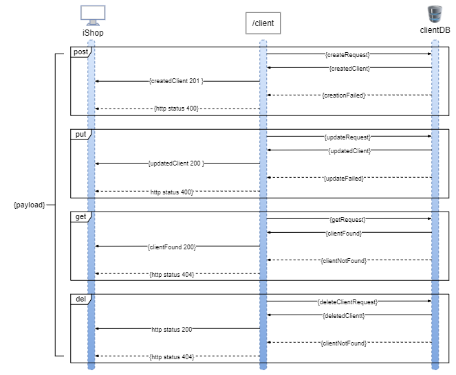

# Client

The Client microservice has the purpose of creating and handling the client information.

## Architecture



### Run and Test

Go to the project root folder

Run local build
```
./gradlew clean build
```

Run tests
```
./gradlew test
```

Check test coverage
open [build/reports/jacoco/test/html/index.html](build/reports/jacoco/test/html/index.html)

Start the application
```
./gradlew bootRun
```